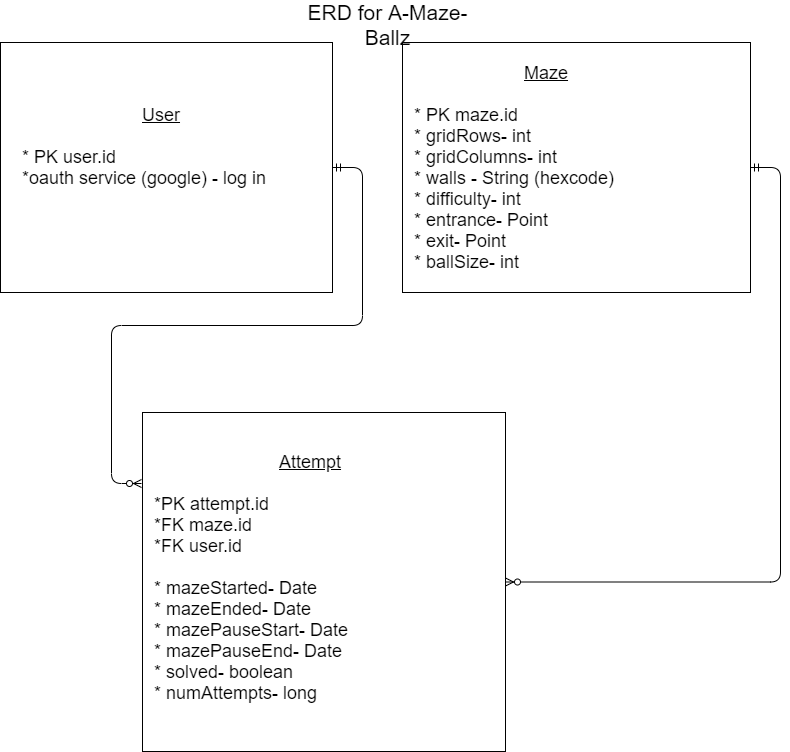

## Entity Relationship Diagrams

#### Entity Classes
 [Maze](https://github.com/edubois9119/a-maze-ballz/blob/master/app/src/main/java/com/ericadubois/amazeballz/model/entity/Maze.java)
 
 [Attempt](https://github.com/edubois9119/a-maze-ballz/blob/master/app/src/main/java/com/ericadubois/amazeballz/model/entity/Attempt.java)
 
 [User](https://github.com/edubois9119/a-maze-ballz/blob/master/app/src/main/java/com/ericadubois/amazeballz/model/entity/User.java)
